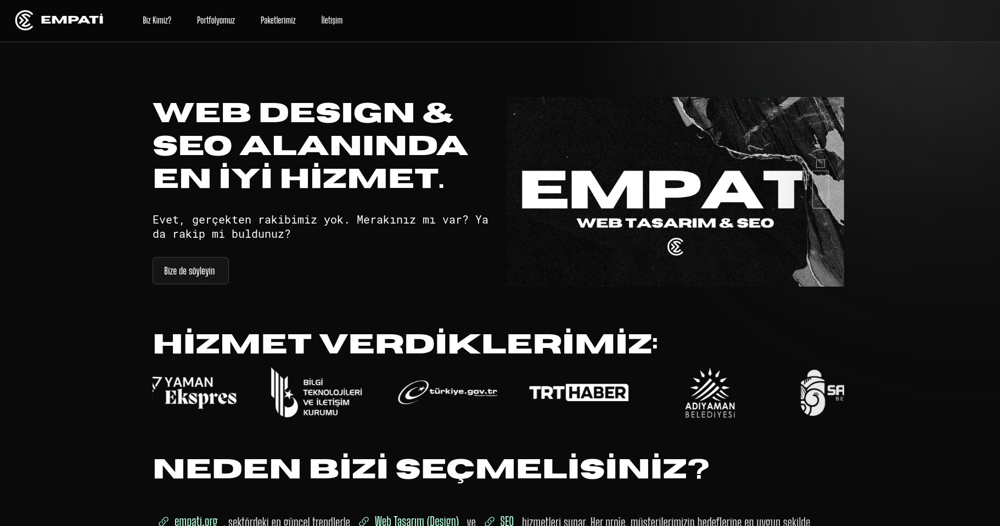

# **Empati Web**  

Empati Web is a modern and user-friendly website design. This project was developed by **Ata İlhan Köktürk**, showcasing creative solutions and an aesthetic approach. Empati Web aims to provide a strong experience in both functionality and visuals.  

This website was built using [OnceUI](https://github.com/once-ui-system/nextjs-starter.git) components. OnceUI offers a performance-focused, flexible, and easily customizable system, enabling developers to bring their projects to life quickly and efficiently.  

### **Project Features**  
- **Modern Design:** Empati Web embraces a minimalist approach, focusing on user experience.  
- **Fast Loading Speed:** Thanks to the optimized structure of OnceUI, the site operates swiftly and seamlessly.  
- **Responsive Design:** Ensures flawless appearance across all devices.  
- **Easy Management:** Developer-friendly infrastructure allows for quick edits and integrations.  

### **Project Screenshots**  

  

Empati Web is built with a robust foundation to add flexibility and innovation to any project. For more information, feel free to explore the project.  

**Project Source:**  
[View the Project on GitHub](https://github.com/once-ui-system/nextjs-starter.git)  